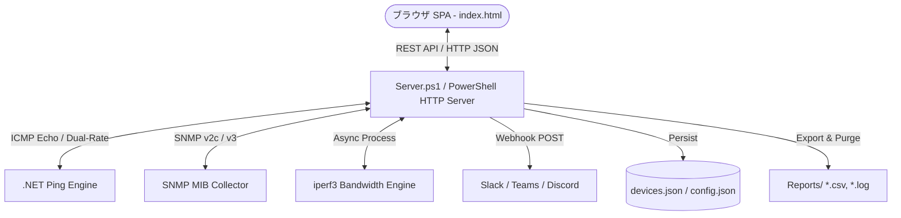

# 🌐 Network Device Monitor & Diagnostic Tool

[](https://microsoft.com/powershell)
[](https://developer.mozilla.org/en-US/docs/Web/JavaScript)
[](LICENSE)
[](https://www.microsoft.com/windows)

**PowerShell製バックエンドHTTPサーバーとモダンSPAフロントエンド（Vis-Network / Chart.js / Web Audio）で構成された、エージェントレス型のオールインワン・ネットワーク機器監視＆診断ツールです。**

---

## 🌟 主な機能 (Key Features)

| カテゴリ | 機能 | 説明 |
| :--- | :--- | :--- |
| **⚡ 死活監視 (Ping)** | **デュアルレート高精度Ping** | 通常監視（1.0s等）に加え、最重要機器2台を0.1秒、他機器を5.0秒で並行監視するデュアルレート監視をサポート。 |
| **📊 通信品質解析** | **パケットロス率 & ジッター算出** | 直近サンプリングからのリアルタイムパケット損失率 (%) および RFC 3550 準拠ジッター (ms) を自動計算。 |
| **⏱ 稼働タイムライン** | **到達性ヒートマップ** | 画面上部に直近の稼働品質（緑: 正常 / 黄: 高遅延 / 赤: 障害 / 灰: 停止）をカラーバーで時系列表示。 |
| **🔔 外部・音声アラート** | **Webhook & Web Audio 音声通知** | Slack/Teams/Discord への自動 Webhook POST、およびブラウザ側でのビープ/チャイム音波合成アラート。 |
| **🌐 トポロジー可視化** | **動的リンクアラートマップ** | `Vis-Network` による機器配置・接続線描画。障害・高遅延時に接続線が赤・黄へと動的カラーチェンジ。 |
| **🔍 SNMP 診断** | **SNMP v2c / v3 詳細情報取得** | インターフェース使用量、Tx/Rx帯域、エラーパケット、システム情報をエージェントレスで収集。 |
| **🚀 帯域計測** | **Iperf3 統合スループット診断** | 同梱の `iperf3` をバックグラウンドで自動制御し、実効スループットをライブ計測・ログ保存。 |
| **💾 バックアップ & 復元** | **1クリック設定エクスポート/インポート** | 登録機器リスト・トポロジー座標・監視パラメータを1つの JSON として即座にバックアップ・復元。 |
| **📑 レポート & 保守** | **日本語CSVサマリー & 自動パージ** | セッション終了時に詳細な日本語サマリーブロックを出力。指定日数を超えた古いログの自動クリーンアップ。 |
| **🛠️ 簡単セットアップ** | **ワンクリック起動** | 外部Webサーバー不要。`Start-Monitor.bat` をダブルクリックするだけで即座にローカルサーバーが起動。 |

---

## 🏗️ システム構成 (Architecture)



---

## 📁 ディレクトリ構成 (Directory Structure)

```
NetworkDeviceMonitor/
├── Start-Monitor.bat              # 🚀 起動用バッチファイル（Windows監視サーバー一発起動）
├── 利用手順書.md                  # 📘 エンドユーザー・運用担当者向け利用マニュアル
├── README.md                      # 📖 プロジェクト概要・仕様書
├── LICENSE                        # 📄 MIT License
├── Reports/                       # 📑 実行時ログ・CSVレポート出力先（自動生成）
│   └── .gitkeep
└── system/                        # 🛠️ 監視システム本体
    ├── Server.ps1                 # メインバックエンドHTTPサーバー
    ├── Measure-Bandwidth.ps1      # SNMPによる帯域計算ロジック
    ├── Launcher.ps1               # 個別デバイス監視ランチャー
    ├── Monitor-SingleDevice.ps1   # 単体デバイス監視スクリプト
    ├── Start-BandwidthServer.ps1  # 帯域監視補助サーバー
    ├── devices.json               # 監視対象デバイス設定
    ├── config.json                # システム全体設定
    ├── README.md                  # 管理者・開発者向け詳細設計書
    ├── iperf3.18_64/              # iperf3 実行バイナリ & NOTICE.md
    └── public/                    # フロントエンド静的アセット (SPA)
        ├── index.html             # メインSPA画面
        ├── style.css              # カスタムスタイルシート
        ├── app.js                 # UIインタラクション・Web Audio・API通信
        ├── chart.js               # チャート描画ライブラリ
        └── vis-network.min.js     # トポロジー図描画エンジン
```

---

## 🚀 起動方法 (Quick Start)

### 前提要件
* **OS**: Windows 10 / 11 / Windows Server 2016 以降
* **PowerShell**: Windows PowerShell 5.1 または PowerShell 7+
* **ブラウザ**: Google Chrome / Microsoft Edge / Firefox

### 起動手順
1. 本リポジトリをクローンまたはダウンロードします。
   ```bash
   git clone https://github.com/Shuntaro1996/network-device-monitor.git
   ```
2. フォルダ内の **`Start-Monitor.bat`** をダブルクリックします。
3. 自動的にブラウザが起動し、監視ダッシュボード（`http://localhost:8081`）が表示されます。

---

## 📖 ドキュメント (Documentation)

* **運用者・一般ユーザー向け**: [利用手順書.md](利用手順書.md)
* **管理者・開発者向け詳細設計書**: [system/README.md](system/README.md)

---

## 👤 作成者 (Author)

* **GitHub**: [@Shuntaro1996](https://github.com/Shuntaro1996)

---

## 📄 ライセンス (License)

本プロジェクトは [MIT License](LICENSE) のもとで公開されています。
