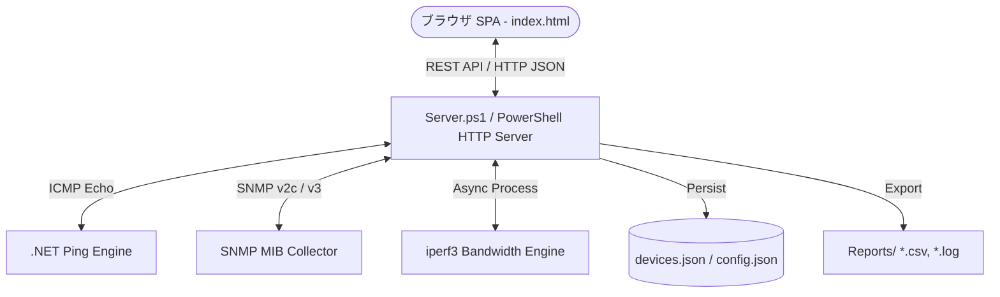

# 🌐 Network Device Monitor & Diagnostic Tool

[](https://microsoft.com/powershell)
[](https://developer.mozilla.org/en-US/docs/Web/JavaScript)
[](LICENSE)
[](https://www.microsoft.com/windows)

**PowerShell製バックエンドHTTPサーバーとモダンSPAフロントエンド（Vis-Network / Chart.js）で構成された、エージェントレス型のオールインワン・ネットワーク機器監視＆診断ツールです。**

---

## 🌟 主な機能 (Key Features)

| カテゴリ | 機能 | 説明 |
| :--- | :--- | :--- |
| **🌐 トポロジー可視化** | **インタラクティブ・ネットワークマップ** | `Vis-Network` を活用し、機器間の接続関係やグループ（フロア/エリア）をグラフィカルに描画・ドラッグ配置。 |
| **⚡ 死活監視 (Ping)** | **高精度リアルタイムPing** | .NET `System.Net.NetworkInformation.Ping` による非同期・並列死活監視とレイテンシ測定。 |
| **📊 トレンド解析** | **時系列グラフ (Chart.js)** | 過去24時間のレイテンシ推移・パケットロス率・ステータス変動をリングバッファでリアルタイム可視化。 |
| **🔍 SNMP 診断** | **SNMP v2c / v3 詳細情報取得** | インターフェース使用量、トラフィックレート、エラーパケット、システム情報をエージェントレスで収集。 |
| **🚀 帯域計測** | **Iperf3 統合スループット診断** | 同梱の `iperf3` をバックグラウンドで自動制御し、実効帯域（Throughput）をライブ計測。 |
| **📑 レポート出力** | **CSV / ログ自動出力** | 監視ログの自動ローテーション（最大3世代）およびCSVレポート出力機能。 |
| **🛠️ 簡単セットアップ** | **ワンクリック起動** | 外部Webサーバー不要。`Start-Monitor.bat` をクリックするだけで即座にローカルサーバーが起動。 |

---

## 🏗️ システム構成 (Architecture)



---

## 📁 ディレクトリ構成 (Directory Structure)

```
NetworkDeviceMonitor/
├── Start-Monitor.bat              # 起動用バッチファイル（ダブルクリックで起動）
├── 利用手順書.md                  # エンドユーザー・運用担当者向け利用マニュアル
├── LICENSE                        # MIT License
├── Reports/                       # 実行時ログ・CSVレポート出力先
└── system/
    ├── README.md                  # 管理者向け詳細設計書
    ├── Server.ps1                 # メインバックエンドHTTPサーバー
    ├── Launcher.ps1               # 個別デバイス監視ランチャー
    ├── Measure-Bandwidth.ps1      # SNMPによる帯域計算ロジック
    ├── Monitor-SingleDevice.ps1   # 単体デバイス監視スクリプト
    ├── Start-BandwidthServer.ps1  # 帯域監視補助サーバー
    ├── devices.json               # 監視対象デバイス設定
    ├── config.json                # システム全体設定
    ├── iperf3.18_64/              # iperf3 実行バイナリ
    └── public/                    # フロントエンド静的アセット
        ├── index.html             # メインSPA画面
        ├── style.css              # カスタムスタイルシート
        ├── app.js                 # UIインタラクション・API通信
        ├── chart.js               # チャート描画ライブラリ
        └── vis-network.min.js     # トポロジー図描画エンジン
```

---

## 🚀 起動方法 (Quick Start)

### 前提要件
* **OS**: Windows 10 / 11 / Windows Server 2016 以降
* **PowerShell**: Windows PowerShell 5.1 または PowerShell 7+
* **ブラウザ**: Google Chrome / Microsoft Edge / Firefox

### 手順
1. 本リポジトリをクローンまたはダウンロードします。
   ```bash
   git clone https://github.com/Shuntaro1996/network-device-monitor.git
   ```
2. フォルダ内の **`Start-Monitor.bat`** をダブルクリックします。
3. 自動的にブラウザが起動し、ダッシュボード（`http://localhost:8081`）が表示されます。

---

## 📖 ドキュメント (Documentation)

* **運用者向け**: [利用手順書.md](利用手順書.md)
* **管理者・開発者向け**: [system/README.md](system/README.md)

---

## 👤 作成者 (Author)

* **GitHub**: [@Shuntaro1996](https://github.com/Shuntaro1996)

---

## 📄 ライセンス (License)

本プロジェクトは [MIT License](LICENSE) のもとで公開されています。
