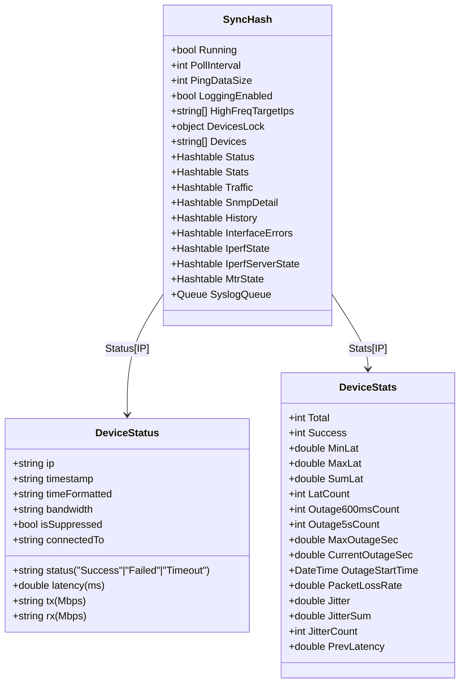
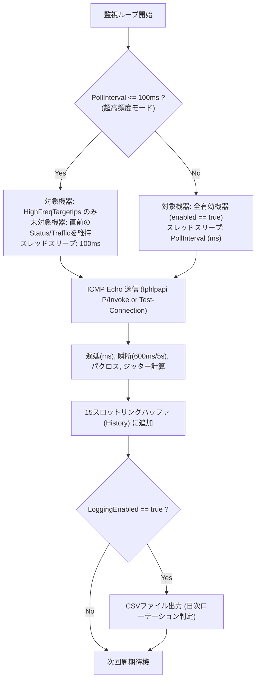
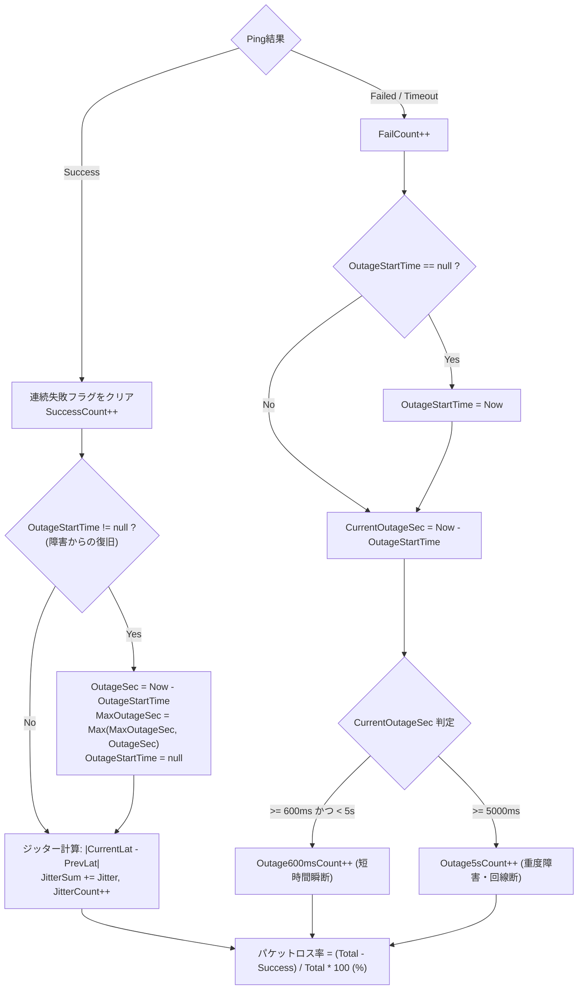
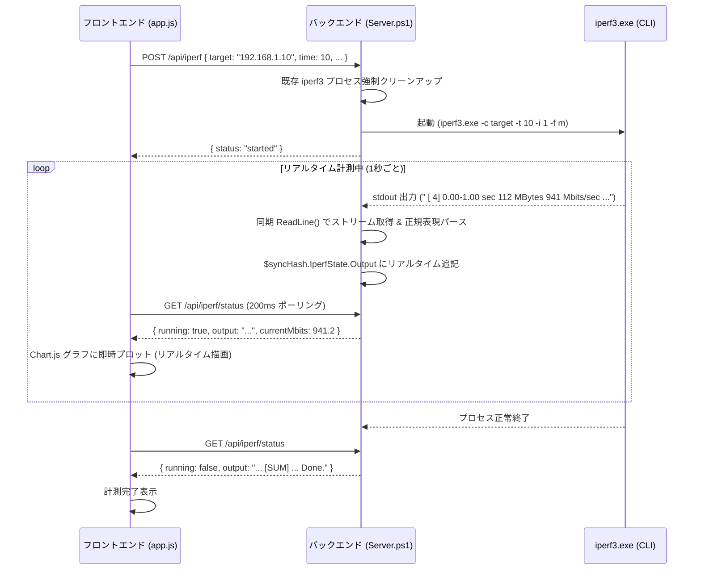
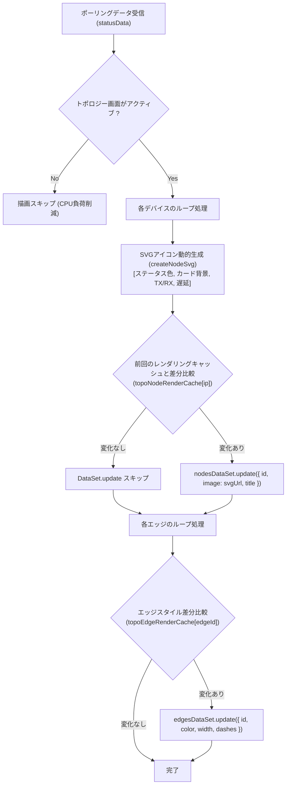
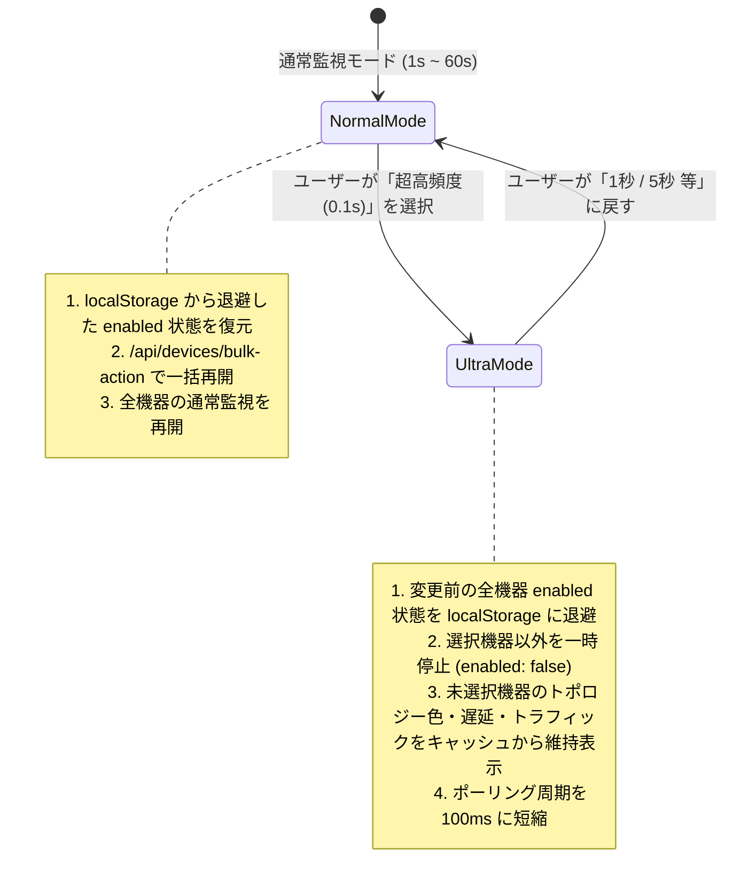
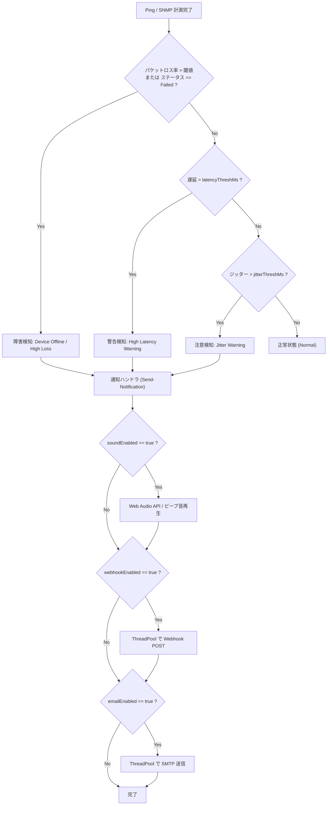
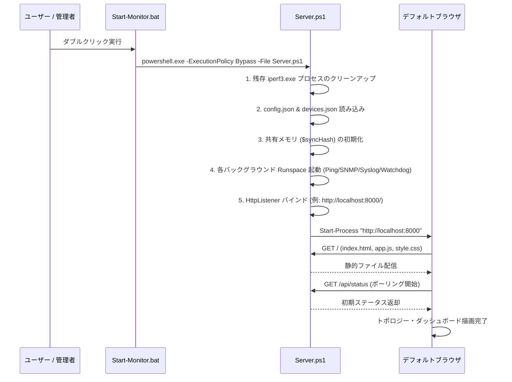

# Network Device Monitor - システム完全技術仕様書

本書は、「Network Device Monitor」のシステムアーキテクチャ、内部処理ロジック、データ構造、全REST API仕様、フロントエンド描画仕様、障害検出アルゴリズム、信頼性・セキュリティ設計を完全に網羅したエンジニア向け技術仕様書です。

---

## 目次

1. [システム概要と全体アーキテクチャ](#1-システム概要と全体アーキテクチャ)
   - [1.1 システム目的と特徴](#11-システム目的と特徴)
   - [1.2 技術スタック](#12-技術スタック)
   - [1.3 全体アーキテクチャ図](#13-全体アーキテクチャ図)
   - [1.4 プロセス・Runspace（スレッド）構成](#14-プロセスrunspaceスレッド構成)
   - [1.5 共有メモリモデルと排他制御](#15-共有メモリモデルと排他制御)
2. [データモデルと設定ファイル仕様](#2-データモデルと設定ファイル仕様)
   - [2.1 devices.json スキーマ定義](#21-devicesjson-スキーマ定義)
   - [2.2 config.json スキーマ定義](#22-configjson-スキーマ定義)
   - [2.3 $syncHash インメモリデータ構造](#23-synchash-インメモリデータ構造)
   - [2.4 出力ログ・CSV仕様](#24-出力ログcsv仕様)
3. [コア監視・計測エンジン仕様](#3-コア監視計測エンジン仕様)
   - [3.1 Ping監視エンジン & 超高頻度モード（100ms）](#31-ping監視エンジン--超高頻度モード100ms)
   - [3.2 瞬断・パケットロス・ジッター判定アルゴリズム](#32-瞬断パケットロスジッター判定アルゴリズム)
   - [3.3 SNMP トラフィック & エラー監視エンジン](#33-snmp-トラフィック--エラー監視エンジン)
   - [3.4 IPerf3 リアルタイム計測エンジン](#34-iperf3-リアルタイム計測エンジン)
   - [3.5 MTR (Visual Traceroute) エンジン](#35-mtr-visual-traceroute-エンジン)
   - [3.6 Syslog 受信・解析エンジン](#36-syslog-受信解析エンジン)
   - [3.7 自動トポロジー解決（CDP / LLDP / ARP / Route）](#37-自動トポロジー解決cdp--lldp--arp--route)
4. [全 REST API 完全仕様書](#4-全-rest-api-完全仕様書)
   - [4.1 API共通仕様](#41-api共通仕様)
   - [4.2 監視・ステータス系 API](#42-監視ステータス系-api)
   - [4.3 デバイス管理系 API](#43-デバイス管理系-api)
   - [4.4 システム設定・バックアップ系 API](#44-システム設定バックアップ系-api)
   - [4.5 診断・計測ツール系 API](#45-診断計測ツール系-api)
   - [4.6 ログ・監査・ライフサイクル系 API](#46-ログ監査ライフサイクル系-api)
5. [フロントエンド仕様 (UI / UX / 描画エンジン)](#5-フロントエンド仕様-ui--ux--描画エンジン)
   - [5.1 SPA 構造と画面遷移](#51-spa-構造と画面遷移)
   - [5.2 Vis-network トポロジー描画エンジン](#52-vis-network-トポロジー描画エンジン)
   - [5.3 超高頻度モード（0.1s）状態退避・復元仕様](#53-超高頻度モード01s状態退避復元仕様)
   - [5.4 Chart.js リアルタイムグラフとメモリ管理](#54-chartjs-リアルタイムグラフとメモリ管理)
   - [5.5 クライアント・ライフサイクル管理](#55-クライアントライフサイクル管理)
6. [アラート・通知・監査ログ仕様](#6-アラート通知監査ログ仕様)
   - [6.1 アラート判定フロー](#61-アラート判定フロー)
   - [6.2 Webhook 通知ペイロード仕様](#62-webhook-通知ペイロード仕様)
   - [6.3 SMTP メール通知仕様](#63-smtp-メール通知仕様)
   - [6.4 音声アラート仕様](#64-音声アラート仕様)
   - [6.5 監査ログ（audit.log）仕様](#65-監査ログauditlog仕様)
7. [高信頼性・例外回復・セキュリティ設計](#7-高信頼性例外回復セキュリティ設計)
   - [7.1 スレッドセーフティとデッドロック防止](#71-スレッドセーフティとデッドロック防止)
   - [7.2 Runspace 自己回復（Watchdog）機構](#72-runspace-自己回復watchdog機構)
   - [7.3 HTTP メインスレッド非ブロッキング設計](#73-http-メインスレッド非ブロッキング設計)
   - [7.4 外部プロセス（iperf3/tracert）のゾンビ化防止](#74-外部プロセスiperf3tracertのゾンビ化防止)
   - [7.5 セキュリティ・堅牢化設計](#75-セキュリティ堅牢化設計)
8. [ファイル構成と起動・運用シーケンス](#8-ファイル構成と起動運用シーケンス)

---

## 1. システム概要と全体アーキテクチャ

### 1.1 システム目的と特徴
本システムは、Windows環境において専用エージェントを導入することなく、PowerShell 5.1/7+ および標準Web技術を用いて以下の機能を提供するエンタープライズ向けネットワーク機器監視・可視化ソリューションです。

1. **超低遅延・高精度監視**: 最短 100ms（0.1秒）周期のPingによるミリ秒単位の瞬断・遅延・ジッター検知。
2. **SNMP v1/v2c/v3 トラフィック・エラー監視**: 64bitカウンタ対応のリアルタイム帯域（Mbps）およびIFエラー（CRC/Discard）の自動収集。
3. **Cisco Packet Tracer 風 動的トポロジー可視化**: グループ背景円、接続線、機器状態のSVG動的生成、差分キャッシュ描画。
4. **統合ネットワーク診断ツール群**: IPerf3 リアルタイムスループット計測（双方向/グラフ連動）、MTR（Visual Traceroute）、Syslog受信（RFC 3164/5424）、IPレンジスキャン。
5. **自己完結型・ポータブル稼働**: 外部Webサーバー不要。PowerShellの `HttpListener` をベースとしたマルチスレッドHTTPサーバーにより単一フォルダで完全稼働。

### 1.2 技術スタック
* **バックエンド**:
  * PowerShell 5.1 / PowerShell 7+
  * .NET Framework (`System.Net.HttpListener`, `System.Net.Sockets.UdpClient`, `System.Threading`, `System.Management.Automation.Runspaces`)
  * C# インラインP/Invoke（高精度タイマー `QueryPerformanceCounter`, `Iphlpapi.dll` ICMP API）
* **フロントエンド**:
  * HTML5 / CSS3 (CSS Variables, Flexbox/Grid, Glassmorphism UI)
  * Vanilla JavaScript (ES6+, 非同期 Fetch API, Web Audio API)
  * Vis-network.js (物理トポロジーネットワークグラフ描画)
  * Chart.js (リアルタイム時系列グラフ描画)
* **外部バイナリ**:
  * `iperf3.exe` (v3.18 64bit)
  * `tracert.exe` (Windows 標準)

---

### 1.3 全体アーキテクチャ図

```mermaid
flowchart TB
    subgraph Browser ["Webブラウザ (SPA Frontend)"]
        UI_Dash["ダッシュボード (Heatmap/List/Chart)"]
        UI_Topo["システムトポロジー (vis-network)"]
        UI_Iperf["IPerf3 リアルタイム計測画面"]
        UI_Syslog["Syslog / 監査ログ ビューア"]
        UI_Manage["機器管理 / システム設定"]
    end

    subgraph Backend ["PowerShell バックエンド (Server.ps1)"]
        subgraph MainThread ["メインスレッド"]
            HTTP_Listener["HttpListener (Port 8000/8080/...)"]
            Router["REST API ルーター & 静的ファイル配信"]
        end

        subgraph ThreadPoolWorkers [".NET ThreadPool (非同期ワーカー)"]
            Worker_Scan["IP Range Scan"]
            Worker_Trace["Traceroute"]
            Worker_SnmpDetail["SNMP Detail Query"]
            Worker_Notify["Webhook / Email Sender"]
        end

        subgraph SharedMemory ["スレッド間共有メモリ ($syncHash)"]
            Sync_Devices["Devices / Config"]
            Sync_Status["Status / Stats / Traffic"]
            Sync_History["History (15-slot Ring Buffer)"]
            Sync_Iperf["IperfState / ServerState"]
            Sync_Syslog["SyslogQueue (Concurrent Queue)"]
            Sync_Locks["DevicesLock (Monitor Lock)"]
        end

        subgraph BackgroundRunspaces ["バックグラウンド Runspaces (常駐監視スレッド)"]
            RS_Ping["Runspace 1: Ping監視エンジン\n(通常 1s~60s / 超高頻度 0.1s)"]
            RS_BW["Runspace 2: 帯域計測エンジン\n(Measure-Bandwidth.ps1)"]
            RS_SNMP["Runspace 3: SNMP基本トラフィック\n(Octets / Errors / Backoff)"]
            RS_SNMP_Det["Runspace 4: SNMPトポロジー収集\n(CDP / LLDP / Speed / Band)"]
            RS_Syslog["Runspace 5: Syslog UDP Listener\n(Port 514 / 1514)"]
            RS_Watchdog["Runspace 6: ハートビート監視 & キー監視\n(自動シャットダウン判定)"]
        end
    end

    subgraph External ["監視対象ネットワーク & 外部連携"]
        Devices["ネットワーク機器 (Switch/Router/Server/AP/Camera/UPS)"]
        SyslogSources["Syslog 送信元機器"]
        WebhookDest["Slack / Teams / Discord Webhook"]
        SMTPServer["SMTP メールサーバー"]
    end

    %% Communications
    UI_Dash <-->|REST API / Polling (2.5s or 100ms)| HTTP_Listener
    UI_Topo <-->|REST API / Topology Update| HTTP_Listener
    UI_Iperf <-->|Stream API / Status| HTTP_Listener
    UI_Syslog <-->|Log Query / Clear| HTTP_Listener
    UI_Manage <-->|CRUD API| HTTP_Listener

    HTTP_Listener --> Router
    Router -->|即時応答| SharedMemory
    Router -->|重い処理をオフロード| ThreadPoolWorkers

    RS_Ping <-->|ICMP Echo / Async Ping| Devices
    RS_SNMP <-->|SNMP v1/v2c/v3 Get/Walk| Devices
    RS_SNMP_Det <-->|SNMP Topology Walk| Devices
    RS_BW <-->|Bandwidth Query| Devices
    Devices -->|UDP 514/1514| RS_Syslog

    RS_Ping --> SharedMemory
    RS_SNMP --> SharedMemory
    RS_SNMP_Det --> SharedMemory
    RS_BW --> SharedMemory
    RS_Syslog --> SharedMemory
    RS_Watchdog --> SharedMemory

    Worker_Notify -->|HTTPS POST| WebhookDest
    Worker_Notify -->|SMTP / TLS| SMTPServer
```

---

### 1.4 プロセス・Runspace（スレッド）構成

| スレッド/Runspace名 | 担当処理 | 実行周期 / トリガー | スレッドモデル |
| :--- | :--- | :--- | :--- |
| **Main Thread** | `HttpListener` による HTTP リクエスト受付、静的ファイル配信、APIルーティング | 常時リッスン (同期ループ) | メインプロセス |
| **Runspace 1: Ping** | 監視対象機器へのPing送信、RTT計測、瞬断検知、パケットロス/ジッター計算、CSVログ記録 | 設定間隔（100ms 〜 60,000ms） | バックグラウンド Runspace |
| **Runspace 2: Bandwidth** | `Measure-Bandwidth.ps1` によるスクリプト帯域計測 | 10秒固定周期 | バックグラウンド Runspace |
| **Runspace 3: SNMP Basic** | SNMPトラフィック（In/Out Octets）およびエラー（Errors/Discards）収集、バックオフ制御 | 設定間隔（5秒 〜 30秒） | バックグラウンド Runspace |
| **Runspace 4: SNMP Detail** | インターフェースリンク速度、Wi-Fi周波数帯、CDP/LLDP隣接機器収集、トポロジー自動親子付け | 30秒固定周期 | バックグラウンド Runspace |
| **Runspace 5: Syslog** | UDP 514 / 1514 ポートでの Syslog パケット受信、パース、キュー格納 | UDPパケット受信時（即時） | バックグラウンド Runspace |
| **Runspace 6: Watchdog** | コンソールキー入力検知（Enterキー停止）、ブラウザハートビート監視（60秒無通信で自動保存＆終了） | 200ms 周期 | バックグラウンド Runspace |
| **ThreadPool Workers** | IPレンジスキャン、Traceroute、SNMP詳細クエリ、Webhook送信、メール送信 | APIリクエスト時に動的生成 | .NET ThreadPool |

---

### 1.5 共有メモリモデルと排他制御

すべてのスレッド間通信は、PowerShellの `[hashtable]::Synchronized(@{})` で作成された `$syncHash` を介して行われます。

```mermaid
flowchart LR
    subgraph Writers ["書き込みスレッド"]
        API["REST API (Main / Worker)"]
        PingRS["Ping Runspace"]
        SnmpRS["SNMP Runspace"]
    end

    subgraph Memory ["$syncHash (Synchronized Hashtable)"]
        DevList["Devices (@(IPs))"]
        DevMeta["DeviceName, Community, Group, ..."]
        LockObj["DevicesLock (Object)"]
        StatusMap["Status, Stats, Traffic, SnmpDetail"]
    end

    subgraph Readers ["読み込みスレッド"]
        Polling["/api/status (Main)"]
        Topo["Topology Resolver (RS4)"]
    end

    API -->|Monitor::Enter(DevicesLock)| LockObj
    API -->|Update| DevList
    API -->|Update| DevMeta
    LockObj -->|Monitor::Exit(DevicesLock)| API

    PingRS -->|Snapshot: $devs = $syncHash.Devices| DevList
    SnmpRS -->|Snapshot: $devs = $syncHash.Devices| DevList

    PingRS -->|Write| StatusMap
    SnmpRS -->|Write| StatusMap

    StatusMap -->|Read| Polling
    DevList -->|Read| Topo
```

#### 排他制御ルール
1. **`DevicesLock` による CRUD 排他制御**:
   デバイスリスト（`$syncHash.Devices`）およびメタデータハッシュテーブル（`Community`, `DeviceName`, `Group`, `IsMonitored` 等）を変更するAPI（`delete`, `add`, `bulk`, `edit`, `reorder`, `positions`, `bulk-action`, `import`）は、必ず以下のように `[System.Threading.Monitor]` で保護されます。
   ```powershell
   [System.Threading.Monitor]::Enter($syncHash.DevicesLock)
   try {
       # デバイス配列の再構築とハッシュテーブル更新
       Save-DevicesJson
   } finally {
       [System.Threading.Monitor]::Exit($syncHash.DevicesLock)
   }
   ```
2. **イミュータブル・スナップショット列挙**:
   各監視Runspaceは、ループ開始時に `$devices = $syncHash.Devices` で配列の参照スナップショットを取得してから `foreach` 処理を行います。これにより、反復処理中にAPIからデバイスが追加・削除されても `Collection was modified` 例外が発生しません。
3. **Syslog キューの排他制御**:
   `$syncHash.SyslogQueue`（`Queue`）へのアクセスは、`[System.Threading.Monitor]::Enter($syncHash.SyslogQueue.SyncRoot)` で排他制御されます。

---

## 2. データモデルと設定ファイル仕様

### 2.1 devices.json スキーマ定義
機器一覧を保存するJSONファイル（`system/devices.json`）のスキーマ定義です。

```json
[
  {
    "ip": "192.168.1.1",
    "name": "Core-RT01",
    "community": "public",
    "group": "Core Network",
    "enabled": true,
    "image": "router",
    "connectedTo": "",
    "x": 100.5,
    "y": -50.2,
    "mac": "00:11:22:33:44:55",
    "location": "Server Room Rack A-1",
    "vendorContact": "Cisco Support: 0120-xxx-xxx",
    "troubleMemo": "Gi0/1 is WAN uplink",
    "deviceType": "network",
    "webUrl": "https://192.168.1.1",
    "snmpVersion": "v2c",
    "snmpUser": "",
    "snmpAuthProto": "none",
    "snmpAuthPass": "",
    "snmpPrivProto": "none",
    "snmpPrivPass": ""
  }
]
```

#### フィールド定義表

| フィールド名 | 型 | デフォルト値 | 必須 | 説明 |
| :--- | :--- | :--- | :---: | :--- |
| `ip` | `string` | - | **Yes** | 機器のIPv4アドレス（一意の主キー） |
| `name` | `string` | `ip` と同一 | No | 表示名（ホスト名・機器名称） |
| `community` | `string` | `"public"` | No | SNMP v1/v2c コミュニティ名 |
| `group` | `string` | `""` | No | 所属グループ名（トポロジー図で同一グループの背景円を描画） |
| `enabled` | `boolean` | `true` | No | 監視有効フラグ（`false` の場合は監視一時停止） |
| `image` | `string` | `""` | No | アイコン種別（`router`, `switch`, `server`, `pc`, `printer`, `ap`, `camera`, `power`, `bridge`, またはアップロード画像URL） |
| `connectedTo` | `string` | `""` | No | 親ノードのIPアドレス（カンマ区切りで複数指定可能）。トポロジー図でエッジを結ぶ |
| `x`, `y` | `number` | `null` | No | トポロジー図上の固定座標（ドラッグ配置保存時） |
| `mac` | `string` | `""` | No | 機器のMACアドレス |
| `location` | `string` | `""` | No | 設置場所（ラック番号、部屋名など） |
| `vendorContact` | `string` | `""` | No | ベンダー連絡先・保守契約番号 |
| `troubleMemo` | `string` | `""` | No | トラブルシューティング用メモ・注意点 |
| `deviceType` | `string` | `"network"` | No | 機器カテゴリ（`network`, `server`, `client`, `iot`, `power`） |
| `webUrl` | `string` | `""` | No | 機器の管理GUI Web URL |
| `snmpVersion` | `string` | `"v2c"` | No | SNMPバージョン（`"v1"`, `"v2c"`, `"v3"`） |
| `snmpUser` | `string` | `""` | No | SNMPv3 ユーザー名（USM） |
| `snmpAuthProto`| `string` | `"none"` | No | SNMPv3 認証プロトコル（`"none"`, `"MD5"`, `"SHA"`, `"SHA256"`） |
| `snmpAuthPass` | `string` | `""` | No | SNMPv3 認証パスワード |
| `snmpPrivProto`| `string` | `"none"` | No | SNMPv3 暗号化プロトコル（`"none"`, `"DES"`, `"AES"`, `"AES128"`） |
| `snmpPrivPass` | `string` | `""` | No | SNMPv3 暗号化パスワード |

---

### 2.2 config.json スキーマ定義
監視エンジンの動作パラメータ（`system/config.json`）のスキーマ定義です。

```json
{
  "pollInterval": 1000,
  "pingDataSize": 32,
  "loggingEnabled": true,
  "highFreqTargetIps": [],
  "outageThresh1Ms": 600,
  "outageThresh2Ms": 5000,
  "latencyThreshMs": 50,
  "packetLossThreshPct": 5.0,
  "jitterThreshMs": 15.0,
  "logRetentionDays": 30,
  "webhookUrl": "https://hooks.slack.com/services/...",
  "webhookEnabled": false,
  "webhookOfflineOnly": true,
  "smtpHost": "smtp.gmail.com",
  "smtpPort": 587,
  "smtpSsl": true,
  "smtpUser": "alerts@example.com",
  "smtpPass": "********",
  "smtpFrom": "alerts@example.com",
  "smtpTo": "admin@example.com",
  "emailEnabled": false,
  "soundEnabled": true,
  "soundVolume": 0.8
}
```

---

### 2.3 $syncHash インメモリデータ構造



---

### 2.4 出力ログ・CSV仕様

#### 1. 監視ログCSV (`reports/sessions/{IP}.csv` および `{IP}_{TIMESTAMP}.csv`)
日次ローテーション（日付変更時にアーカイブ）され、UTF-8（BOM付き）で出力されます。
```csv
Timestamp,IP,Status,LatencyMs,TxMbps,RxMbps
2026-08-30 06:00:01,192.168.1.1,Success,1.24,45.2,12.8
2026-08-30 06:00:02,192.168.1.1,Success,1.31,46.1,13.2
2026-08-30 06:00:03,192.168.1.1,Failed,,0,0
```

#### 2. 監査ログ (`reports/audit.log`)
管理操作（機器の追加/編集/削除、一括変更、設定更新、ログクリア等）を記録します。
```text
[2026-08-30 06:01:23] ACTION: DEVICE_ADD | TARGET: 192.168.1.50 | DETAILS: Device Switch-02 (192.168.1.50) registered | CLIENT: 127.0.0.1
[2026-08-30 06:02:10] ACTION: CONFIG_UPDATE | TARGET: SystemConfig | DETAILS: PollInterval changed to 1000ms | CLIENT: 127.0.0.1
```

---

## 3. コア監視・計測エンジン仕様

### 3.1 Ping監視エンジン & 超高頻度モード（100ms）

Ping監視Runspace（`$pingScript`）は、登録された機器に対してICMP Echoリクエストを送信し、高精度なRTT計測と状態判定を行います。



* **通常モード（1s 〜 60s）**:
  全監視対象機器（`enabled !== false`）に対して並列/高速Pingを実行。
* **超高頻度モード（100ms / 0.1秒）**:
  特定の重要機器（`highFreqTargetIps`）のみを対象に100ms周期で極限計測。それ以外の機器は「直前の正常生存色・遅延・トラフィック」をキャッシュから維持し、無駄なICMPストームとCPU負荷を防止。

---

### 3.2 瞬断・パケットロス・ジッター判定アルゴリズム

ミリ秒単位の回線品質低下およびマイクロ秒単位の瞬断を正確に捕捉します。



1. **瞬断カウンタ（600ms / 5s 判定）**:
   * **600ms瞬断**: Wi-FiローミングやSTP再計算、Spanning Treeトポロジー変更に伴うサブ秒単位の切断を捕捉。
   * **5秒瞬断**: 機器リブートや回線切断、ルーティング収束遅延などの重大障害を捕捉。
2. **RFC 3550 準拠ジッター計算**:
   連続する2回の成功パケットの遅延差分絶対値（`$jitter = [math]::Abs($currentLatency - $prevLatency)`）を算出し、平均ジッターを保持。

---

### 3.3 SNMP トラフィック & エラー監視エンジン

SNMP Runspace（`$snmpScriptBlock`）は、標準 MIB-II（RFC 1213 / RFC 2863 IF-MIB）から機器の通信量とインターフェース品質を取得します。

#### 1. 取得OID一覧

| 項目 | 32bit OID | 64bit 高速OID (HC) | 用途 |
| :--- | :--- | :--- | :--- |
| **In Octets** | `.1.3.6.1.2.1.2.2.1.10` | `.1.3.6.1.2.1.31.1.1.1.6` | 受信バイト数（Rx） |
| **Out Octets** | `.1.3.6.1.2.1.2.2.1.16` | `.1.3.6.1.2.1.31.1.1.1.10` | 送信バイト数（Tx） |
| **In Errors** | `.1.3.6.1.2.1.2.2.1.14` | - | 受信エラーパケット数（CRC/Frame等） |
| **Out Errors** | `.1.3.6.1.2.1.2.2.1.20` | - | 送信エラーパケット数（Collision等） |
| **In Discards** | `.1.3.6.1.2.1.2.2.1.13` | - | 受信廃棄パケット数（バッファ枯渇等） |
| **Out Discards**| `.1.3.6.1.2.1.2.2.1.19` | - | 送信廃棄パケット数（キュー溢れ等） |

#### 2. ロールオーバー対応 帯域算出式
32bitカウンタ（$2^{32} = 4,294,967,296$）のオーバーフローを自動補正して正確なMbpsを算出します。
$$\Delta \text{Bytes} = \begin{cases} \text{Current} - \text{Prev} & (\text{Current} \ge \text{Prev}) \\ (\text{Current} + 2^{32}) - \text{Prev} & (\text{Current} < \text{Prev}) \end{cases}$$
$$\text{Traffic (Mbps)} = \frac{\Delta \text{Bytes} \times 8}{\Delta \text{Time (sec)} \times 10^6}$$

#### 3. 早期スキップ & 指数バックオフ制御
SNMP未対応機器や無応答機器に対するタイムアウト遅延を解消する設計です。
* **早期スキップ**: 最初のOID（InOctets）への問い合わせがタイムアウトした場合、残りの5つのOID問い合わせを即座にスキップ。
* **指数バックオフ**: 連続失敗回数に応じて次回ポーリングまでのスキップ時間（30秒 $\to$ 60秒 $\to$ 120秒）を設定し、無駄なUDPパケット送信を停止。

---

### 3.4 IPerf3 リアルタイム計測エンジン

ネットワーク間の最大TCP/UDPスループットを計測・可視化します。



* **リアルタイム性**: 非同期バッファリング遅延を回避するため、PowerShell側で同期 `ReadLine()` をループ実行し、出力行を即座に共有メモリへ反映。
* **強制停止**: `/api/iperf/stop` 受信時、`taskkill /F /T /PID` を実行して `iperf3.exe` プロセスツリーをミリ秒単位で完全強制終了。

---

### 3.5 MTR (Visual Traceroute) エンジン
対象ホップごとのRTTとパケットロスを可視化する診断エンジンです。
* `tracert -d -h 15 -w 300 {IP}` をバックグラウンド実行。
* 発見された各ホップ（ゲートウェイIP）に対して継続的なPingを実行し、ホップごとの遅延・ロス率をUI上にリアルタイム表示。

---

### 3.6 Syslog 受信・解析エンジン
ネットワーク機器からの障害通知ログ（RFC 3164 / RFC 5424）をリアルタイムに受信・蓄積します。
* **ポート**: UDP 514（特権ポート）および UDP 1514（非特権ポート代替）を自動バインド。
* **リングバッファ**: メモリ内に最新 1,000 件のログを保持（古いログから自動破棄）。
* **ファシリティ / セベリティ解析**: PRIヘッダ（`<134>`等）から Facility（`local0`, `auth` 等）および Severity（`Emergency`, `Alert`, `Critical`, `Error`, `Warning`, `Notice`, `Info`, `Debug`）を自動抽出。

---

### 3.7 自動トポロジー解決（CDP / LLDP / ARP / Route）
SNMP 詳細収集 Runspace（`$snmpDetailScriptBlock`）が、以下のプロトコルMIBを走査してネットワーク結線（`connectedTo`）を自動解決します。
1. **CDP (Cisco Discovery Protocol)**: `.1.3.6.1.4.1.9.9.23.1.2.1.1`
2. **LLDP (Link Layer Discovery Protocol)**: `.1.0.8802.1.1.2.1.4.1.1`
3. **IP Route Table**: `.1.3.6.1.2.1.4.21.1.7` (NextHop IP)
4. **IP-to-Physical ARP Table**: `.1.3.6.1.2.1.4.22.1.2` (MAC-to-IP)

隣接機器のIPが監視対象一覧（`$syncHash.Devices`）に含まれている場合、自動的に `connectedTo` フィールドを更新してトポロジー図に結線を描画します。

---

## 4. 全 REST API 完全仕様書

### 4.1 API共通仕様
* **ベースURL**: `http://localhost:8000` (または起動時指定ポート)
* **データフォーマット**: `Content-Type: application/json; charset=utf-8`
* **エラーレスポンス形式**:
  ```json
  {
    "error": "エラーメッセージ詳細"
  }
  ```

---

### 4.2 監視・ステータス系 API

#### 1. `GET /api/status`
全監視機器の最新ステータス、遅延、通信量、瞬断回数、IPerf状態を一括取得します。

* **レスポンス (200 OK)**:
```json
{
  "192.168.1.1": {
    "status": "Success",
    "latency": 1.24,
    "ip": "192.168.1.1",
    "timestamp": "2026-08-30T06:00:00",
    "timeFormatted": "06:00:00",
    "tx": "45.2",
    "rx": "12.8",
    "bandwidth": "45.2",
    "errors": {
      "1": { "inErr": 0, "outErr": 0, "inDisc": 0, "outDisc": 0, "dInErr": 0, "dOutErr": 0, "dInDisc": 0, "dOutDisc": 0 }
    },
    "maxOutageSec": 0.0,
    "currentOutageSec": 0.0,
    "outage600msCount": 0,
    "outage5sCount": 0,
    "packetLossRate": 0.0,
    "jitter": 0.12,
    "avgJitter": 0.15,
    "isSuppressed": false,
    "connectedTo": ""
  },
  "_iperf": {
    "Running": false,
    "Output": "",
    "LastUpdate": 0
  }
}
```

---

### 4.3 デバイス管理系 API

| メソッド | URL | 説明 | スレッドセーフティ |
| :--- | :--- | :--- | :--- |
| `GET` | `/api/devices` | 登録機器一覧（`devices.json`）の取得 | スナップショット読込 |
| `POST`| `/api/device` | 単一機器の新規追加 | `DevicesLock` 排他制御 |
| `POST`| `/api/devices/bulk` | 複数機器の一括追加 | `DevicesLock` 排他制御 |
| `POST`| `/api/device/edit` | 機器設定の編集（IP変更、アイコン、接続先等） | `DevicesLock` 排他制御 |
| `POST`| `/api/devices/delete` | 機器の削除および関連履歴・ログのクリーンアップ | `DevicesLock` 排他制御 |
| `POST`| `/api/devices/reorder` | 機器の並び順（表示順序）の保存 | `DevicesLock` 排他制御 |
| `POST`| `/api/devices/positions`| トポロジー図上の座標（x, y）の一括保存 | `DevicesLock` 排他制御 |
| `POST`| `/api/devices/bulk-action`| 選択機器の一括操作（一時停止/再開/削除/グループ変更） | `DevicesLock` 排他制御 |
| `GET` | `/api/devices/export` | 機器設定のエクスポート（JSONダウンロード） | スナップショット読込 |
| `POST`| `/api/devices/import` | 機器設定のインポート（完全上書き復元） | `DevicesLock` 排他制御 |

#### `POST /api/device/edit` リクエスト例
```json
{
  "oldIp": "192.168.1.10",
  "newIp": "192.168.1.10",
  "name": "Core-SW01",
  "group": "Distribution",
  "community": "public",
  "enabled": true,
  "image": "switch",
  "connectedTo": "192.168.1.1",
  "location": "Rack B-2",
  "vendorContact": "03-xxxx-xxxx",
  "troubleMemo": "VLAN 10,20 trunk",
  "deviceType": "network",
  "webUrl": "https://192.168.1.10"
}
```

---

### 4.4 システム設定・バックアップ系 API

| メソッド | URL | 説明 | 処理モデル |
| :--- | :--- | :--- | :--- |
| `GET` | `/api/config` | 現在のシステム設定取得 | 即時応答 |
| `POST`| `/api/config/update` | システム設定の更新（周期、閾値、通知先等） | 即時反映 & JSON保存 |
| `GET` | `/api/config-backup/export` | 設定＋機器情報のフルバックアップJSON生成 | 即時ダウンロード |
| `POST`| `/api/config-backup/import` | バックアップJSONからの完全リストア | `DevicesLock` 排他制御 |
| `POST`| `/api/config-backup/run` | Cisco / Allied Telesis 等の機器コンフィグSSH/TFTP自動取得 | `ThreadPool` 非同期実行 |

---

### 4.5 診断・計測ツール系 API

| メソッド | URL | パラメータ / ボディ | 説明 | 処理モデル |
| :--- | :--- | :--- | :--- | :--- |
| `POST`| `/api/iperf` | `{ target, port, time, reverse, parallel, udp, bandwidth }` | IPerf3 クライアント計測開始 | プロセス起動 & ストリーム |
| `POST`| `/api/iperf/stop`| - | 実行中 IPerf3 の強制終了 | `taskkill` 強制Kill |
| `GET` | `/api/iperf/status`| - | IPerf3 のリアルタイム出力・帯域取得 | 即時応答 (ポーリング用) |
| `POST`| `/api/iperf/server`| `{ action: "start"\|"stop", port: 5201 }` | IPerf3 サーバーモード起動/停止 | プロセス管理 |
| `GET` | `/api/iperf/server/status` | - | IPerf3 サーバー稼働状態取得 | 即時応答 |
| `GET` | `/api/scan` | `?start=192.168.1.1&end=192.168.1.254` | IPレンジ並列Pingスキャン (最大20並列) | **`ThreadPool` 非同期実行** |
| `GET` | `/api/traceroute` | `?target=8.8.8.8` | Tracert によるホップ経路探索 | **`ThreadPool` 非同期実行** |
| `GET` | `/api/device/snmp-details` | `?ip=192.168.1.1` | IF/Route/ARP/TCP/Storage/CPU 詳細SNMP取得 | **`ThreadPool` 非同期実行** |
| `GET` | `/api/mtr` | `?ip=192.168.1.1&action=start\|status\|stop` | Visual MTR 計測・ステータス取得 | プロセス管理 |

---

### 4.6 ログ・監査・ライフサイクル系 API

| メソッド | URL | 説明 |
| :--- | :--- | :--- |
| `GET` | `/api/syslog` | 受信済み Syslog ログ一覧取得 |
| `POST`| `/api/syslog/clear` | Syslog バッファのクリア |
| `GET` | `/api/audit-logs` | 監査ログ（最新200件）取得 |
| `GET` | `/api/history` | 特定機器のPing履歴CSVデータ取得（`?ip=...`） |
| `POST`| `/api/history/clear`| 全機器の履歴データ・メモリキャッシュのクリア |
| `GET` | `/api/history/download` | セッション全ログのZIP/CSV一括ダウンロード |
| `POST`| `/api/email/test` | SMTP テストメール送信 (**`ThreadPool` 非同期実行**) |
| `POST`| `/api/webhook/test`| Webhook テスト通知送信 (**`ThreadPool` 非同期実行**) |
| `GET` | `/api/heartbeat` | クライアント生存通知（タイムアウトタイマー延長） |
| `POST`| `/api/shutdown` | ブラウザ終了時のサーバー安全終了ビーコン |

---

## 5. フロントエンド仕様 (UI / UX / 描画エンジン)

### 5.1 SPA 構造と画面遷移
フロントエンドはフレームワークを使用しない Pure Vanilla JavaScript による SPA (Single Page Application) です。
* **ダッシュボード画面 (`view-dashboard`)**:
  * グループ別タブ切り替え、機器ステータスカード一覧、ヒートマップタイムライン、Chart.js 遅延推移グラフ、サマリー統計。
* **システムトポロジー画面 (`view-topology`)**:
  * Vis-network による Packet Tracer 風グラフィカル結線図、ドラッグ＆ドロップ接続、右クリックコンテキストメニュー、機器詳細編集モーダル。
* **IPerf3 計測画面 (`view-iperf`)**:
  * サーバー/クライアント切り替え、リアルタイム折れ線グラフ、コンソールリアルタイムストリーミング出力、設定プリセット。
* **Syslog / 監査ログ画面 (`view-syslog`)**:
  * ファシリティ/セベリティ色分けテーブル、リアルタイム受信、フィルタリング検索。
* **機器・システム管理画面 (`view-manage`)**:
  * 機器一覧テーブル、CSV/JSON一括インポート・エクスポート、監視パラメータ設定、通知先設定。

---

### 5.2 Vis-network トポロジー描画エンジン



1. **動的 SVG ノード生成 (`createNodeSvg`)**:
   各ノードは HTML5 インライン SVG として動的にレンダリングされます。機器種別アイコン、生存状態カラーリング（緑：正常 / 黄：高遅延・注意 / 赤：オフライン / 灰：停止中）、通信量バッジ（Tx/Rx Mbps）、遅延バッジが単一のSVG画像としてVis-networkに提供されます。
2. **Cisco Packet Tracer 風 グループ背景円**:
   Vis-network の `beforeDrawing` イベントフックを使用し、同一 `group` に属するノード群の重心座標 $(c_x, c_y)$ と最大半径 $R$ をリアルタイム計算して、半透明のカラーサークルとグループラベルを描画します。
3. **差分レンダリングキャッシュ**:
   `topoNodeRenderCache` および `topoEdgeRenderCache` により、前回のSVGデータURLおよびツールチップ文字列と完全一致する場合は `nodesDataSet.update()` をスキップ。高頻度ポーリング時でもCanvasの再描画を極小化します。

---

### 5.3 超高頻度モード（0.1s）状態退避・復元仕様

0.1秒モード切り替え時におけるユーザー操作と状態遷移の仕様です。



---

### 5.4 Chart.js リアルタイムグラフとメモリ管理
* **リングバッファ構造**:
  * ダッシュボード遅延グラフ（`dashboardUnifiedChart`）: 最新 15 点固定。
  * IPerf3 帯域グラフ（`iperfChart`）: 最大 60 点でスライス（`slice(-60)`）。
* **メモリリーク対策**:
  タブ切り替え時やモーダル破棄時に Chart.js インスタンスの `destroy()` を確実に呼び出し、DOM参照を解放。

---

### 5.5 クライアント・ライフサイクル管理
* **ハートビート (`setInterval 2500ms`)**:
  ブラウザが生存している間、2.5秒ごとに `/api/heartbeat` をGET送信。
* **フォアグラウンド復帰時の即時同期**:
  `document.addEventListener('visibilitychange')` および `window.addEventListener('focus')` により、タブがバックグラウンドから復帰した瞬間に即座にハートビートを再送し、サーバー側のタイムアウト（60秒）を確実にリセット。
* **安全な終了ビーコン (`navigator.sendBeacon`)**:
  ブラウザのタブ/ウィンドウが閉じられた際、`beforeunload` / `pagehide` イベントで `/api/shutdown` を送信し、サーバープロセスを安全に終了・ログ保存。

---

## 6. アラート・通知・監査ログ仕様

### 6.1 アラート判定フロー



---

### 6.2 Webhook 通知ペイロード仕様
Slack、Microsoft Teams、Discord、汎用Webhookに自動対応するJSONペイロードです。

```json
{
  "text": "🚨 【障害検知】Core-SW01 (192.168.1.10) がオフラインになりました",
  "attachments": [
    {
      "color": "#ef4444",
      "title": "ネットワーク監視アラート - Device Offline",
      "fields": [
        { "title": "対象機器", "value": "Core-SW01", "short": true },
        { "title": "IPアドレス", "value": "192.168.1.10", "short": true },
        { "title": "所属グループ", "value": "Core Network", "short": true },
        { "title": "発生時刻", "value": "2026-08-30 06:15:30", "short": true },
        { "title": "詳細", "value": "ICMP Echo 応答なし (Ping Timeout)", "short": false }
      ]
    }
  ]
}
```

---

### 6.3 SMTP メール通知仕様
* **プロトコル**: SMTP / SMTPS (STARTTLS / SSL 対応)
* **認証**: プレーン認証 / STARTTLS / SSL/TLS (ポート 25, 465, 587 対応)
* **件名フォーマット**:
  * 障害時: `【障害検知】ネットワーク機器監視システム - {DeviceName} ({IP}) オフライン`
  * 復旧時: `【復旧完了】ネットワーク機器監視システム - {DeviceName} ({IP}) オンライン復帰`

---

### 6.4 音声アラート仕様
* **実装方式**: Web Audio API (`AudioContext` によるビープ音シンセサイズ) および `Audio` オブジェクトによる音声ファイル再生。
* **音量制御**: `soundVolume` (0.0 〜 1.0) に連動。
* **サウンド種別**:
  * オフライン（障害）: 高音ビープ（警報音）
  * オンライン（復旧）: チャイム音
  * 瞬断検知: 短音クリック

---

### 6.5 監査ログ（audit.log）仕様
システムの全変更操作を `reports/audit.log` にタイムスタンプ付きで記録します。

| アクション名 | 記録契機 | 記録内容 |
| :--- | :--- | :--- |
| `DEVICE_ADD` | 機器新規登録時 | 機器名、IP、登録クライアントIP |
| `DEVICE_EDIT` | 機器設定変更時 | 変更前後のIP、変更項目名 |
| `DEVICE_DELETE` | 機器削除時 | 削除対象IP |
| `CONFIG_UPDATE` | システム設定変更時 | 変更されたパラメータ名と新しい値 |
| `BULK_ACTION` | 一括操作実行時 | 操作種別（pause/resume/delete等）、対象IPリスト |
| `SYSLOG_CLEAR` | Syslogバッファ消去時 | 実行クライアントIP |
| `EMAIL_TEST` | メール送信テスト時 | 送信先アドレス、成否 |

---

## 7. 高信頼性・例外回復・セキュリティ設計

### 7.1 スレッドセーフティとデッドロック防止
* **個別ロックの原則**: `$syncHash` 全体をロックするのではなく、書き込み競合が発生するリソースごとに専用のロックオブジェクト（`DevicesLock`, `SyslogQueue.SyncRoot`）を使用。
* **短いロック保持時間**: `Monitor::Enter` 内ではインメモリ更新とJSONファイル保存のみを行い、HTTP通信やスレッドスリープなどの重い処理はロック外で実行。
* **Monitor::Exit の finally 保証**: すべてのロック獲得箇所で `try ... finally` を徹底し、例外発生時でもロック解放漏れによるデッドロックを完全に防止。

### 7.2 Runspace 自己回復（Watchdog）機構
監視スレッド内で外部ネットワーク起因のソケット例外やメモリ不足が発生しても、プロセスがクラッシュしない多重保護構造を採用しています。

```powershell
# 各 Runspace の基本設計パターン
while ($syncHash.Running) {
    try {
        # 監視・計測処理
    } catch {
        # 例外を debug.log に記録し、数秒待機して自動再試行
        try { [System.IO.File]::AppendAllText($logPath, "Error: $($_.Exception.Message)`r`n", [System.Text.Encoding]::UTF8) } catch {}
        Start-Sleep -Seconds 5
    }
}
```

### 7.3 HTTP メインスレッド非ブロッキング設計
`HttpListener` を実行するメインスレッドは、数ミリ秒以内にレスポンスを返す処理のみを同期実行します。
* **非同期オフロード対象**:
  * `/api/scan`（最大254アドレスへの並列Ping）
  * `/api/traceroute`（最大15ホップの経路探索）
  * `/api/device/snmp-details`（複数MIBテーブルのWalk処理）
  * `/api/email/test`, `/api/webhook/test`（外部通信）
* **オフロード実装**: `[System.Threading.ThreadPool]::QueueUserWorkItem` を使用し、処理完了時に `HttpListenerResponse` へ直接JSONを出力して接続をクローズ。

### 7.4 外部プロセス（iperf3/tracert）のゾンビ化防止
* **起動前クリーンアップ**: サーバー起動時（`Server.ps1` 冒頭）に、以前のセッションで残存した `iperf3.exe` を自動検出して安全に終了。
* **プロセスツリー Kill**: 停止要求時は `taskkill /F /T /PID {PID}` を発行し、子プロセスを含めて確実に強制終了。

### 7.5 セキュリティ・堅牢化設計
* **Path Traversal 防御**: 静的ファイル配信時、リクエストパスの正規化（`GetFullPath`）を行い、`publicDir` 外へのディレクトリトラバーサルアクセスを `403 Forbidden` で遮断。
* **IPアドレス形式の厳格検証**: すべてのAPI入力において、正規表現 `^(?:(?:25[0-5]|2[0-4][0-9]|[01]?[0-9][0-9]?)\.){3}(?:25[0-5]|2[0-4][0-9]|[01]?[0-9][0-9]?)$` によるIPv4形式検証を実施。
* **SNMPv3 暗号化通信**: SHA / AES による USM 認証暗号化を完全サポートし、平文コミュニティ名漏洩リスクを排除。

---

## 8. ファイル構成と起動・運用シーケンス

### 8.1 ディレクトリ構成

```text
NetworkDeviceMonitor/
├── SPECIFICATION.md          # システム完全技術仕様書 (本書)
├── README.md                 # 簡易概要・クイックスタート
├── 利用手順書.md             # エンドユーザー向け操作マニュアル
├── Start-Monitor.bat         # ワンクリック起動バッチ
├── Reports/                  # 永続ログ・レポート保存先
│   ├── audit.log             # 操作監査ログ
│   ├── Configs/              # 機器コンフィグバックアップ保存先
│   └── sessions/             # 各セッションのPing履歴CSV
└── system/                   # システムコアディレクトリ
    ├── Server.ps1            # バックエンドサーバー & 監視コアエンジン
    ├── Launcher.ps1          # 起動前ポート・権限チェッカー
    ├── Measure-Bandwidth.ps1 # 帯域計測補助スクリプト
    ├── config.json           # システム設定ファイル
    ├── devices.json          # 監視対象機器リスト
    ├── iperf3.18_64/         # iperf3 実行バイナリ (64bit)
    │   ├── iperf3.exe
    │   └── cygwin1.dll
    └── public/               # フロントエンド静的ファイル群
        ├── index.html        # SPA メインHTML
        ├── app.js            # フロントエンド制御ロジック
        ├── style.css         # UIスタイルシート
        ├── vis-network.min.js# トポロジー描画ライブラリ
        ├── chart.umd.min.js  # グラフ描画ライブラリ
        ├── sounds/           # アラート効果音ファイル
        └── uploads/          # ユーザーアップロード機器画像
```

---

### 8.2 起動シーケンス



---

### 8.3 終了シーケンス
1. **ブラウザを閉じた場合**:
   * ブラウザが `navigator.sendBeacon('/api/shutdown')` を送信。
   * サーバー側で `PendingShutdown` フラグが立ち、ログファイルを安全に保存して `HttpListener` を停止、全Runspaceを解放してPowerShellプロセスが正常終了。
2. **コンソールで Enter キーを押した場合**:
   * `$keyScript` がキー入力を検知し、`$syncHash.Shutdown = $true` を設定。
   * 全スレッドを安全に停止し、CSVバッファをフラッシュして終了。
3. **ブラウザ切断（クラッシュ・電源断）**:
   * ハートビートが 60 秒間途絶えた場合、Watchdog Runspace が自動切断を検知し、安全にログを保存してサーバーを自動停止。
